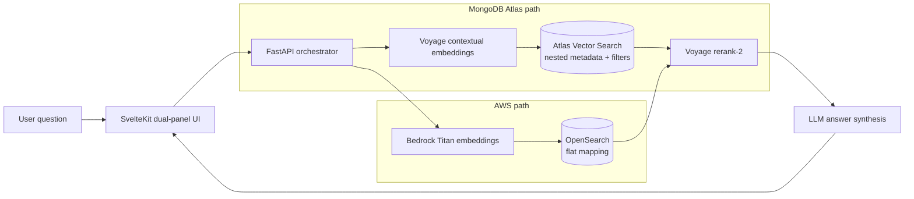

# Banking RAG — MongoDB Atlas vs. Aurora + OpenSearch

> **An honest, side-by-side benchmark of two retrieval stacks for banking policy Q&A.**
> Sanitized public version of a real-world prototype — client names, credentials, and internal endpoints removed; all configuration is environment-driven (`.env.example`). Authored by [Paul Cleenewerck](https://github.com/pcleene).

## Context

Enterprises evaluating Retrieval-Augmented Generation (RAG) for internal knowledge often have to choose between consolidating on **MongoDB Atlas Vector Search** or assembling the AWS-native path (**Aurora PostgreSQL + `pgvector`, OpenSearch, and Bedrock**). This project builds *both* pipelines behind a single UI and runs identical questions through them so the trade-offs are visible rather than asserted.

The corpus is a realistic banking knowledge base (policies, product disclosures, board/leadership facts, KYC procedures) that deliberately contains **superseded document versions** — the hard part of real enterprise retrieval.

## Architecture



## What this demonstrates

- **Apples-to-apples evaluation harness** — same questions, same reranker (Voyage `rerank-2`), toggleable filters, so differences come from the *retrieval layer*, not the prompt.
- **Metadata modeling matters** — Atlas stores **nested** document structure (`source.status`, `lineage.supersedes`, person→role→entity), preserving relationships. OpenSearch's **flat mapping** loses those associations (e.g. "who is the CEO?" becomes unanswerable when names and roles are separate comma-lists).
- **Native filtering vs. token waste** — filtering out superseded policies at the database level (Atlas) vs. retrieving outdated content and paying for it downstream.
- **Hybrid retrieval** — native `$rankFusion` on Atlas vs. manual Reciprocal Rank Fusion on the AWS side.
- **Operational surface area** — one managed platform (Atlas) vs. three services to wire and run (Aurora + OpenSearch + Bedrock).

## Honest results

Run with a small corpus, identical filters, and shared reranking, the two stacks score **nearly identically** — which is itself the finding: *with a small corpus and a strong shared reranker, the retrieval backend is not the bottleneck.* The architectural differences (nested vs. flat metadata, native filtering, single- vs. multi-service ops) only widen as the corpus grows and as relationship-aware queries increase. The repo documents the scenario suite, where each stack wins, and exactly why (see `docs/DEMO_STRATEGY.md`).

## Tech stack

FastAPI (async PyMongo) · SvelteKit · MongoDB Atlas Vector Search · Aurora PostgreSQL (`pgvector`) · Amazon OpenSearch · Voyage AI (embeddings + reranking) · Amazon Bedrock (Titan)

## Quick start

```bash
cp .env.example .env            # add your Atlas URI, AWS + Voyage keys
cd backend && pip install -r requirements.txt && uvicorn main:app --reload
cd frontend && npm install && npm run dev
```

See `docs/` for the scenario suite, demo strategy, and per-pipeline notes.

## Author

[Paul Cleenewerck](https://github.com/pcleene) — MongoDB-focused solution architecture and hands-on prototyping.

## License

See `LICENSE`. If no license file is present, contact the author before reuse.
